# 《把人生变成一片可被看见的宇宙》

## 混沌人生数据库 · 产品故事版

> 我们每天都在经历很多事，但大多数都悄悄消失在时间里。
> 这个作品想做的，不是“多一个记录工具”，而是给人生一张可被回望的宇宙地图。

---

## 一、为什么做这个产品

很多记录类产品都解决了“写下来”，却很难解决“看懂自己”。

我们面对的真实困境是：

- 记录很多，但分散在不同平台，无法形成整体理解
- 记忆很多，但回顾时只能按时间翻页，无法看到关系
- 情绪很多，但长期趋势不可见，难以沉淀经验

于是我们提出一个问题：
**如果每一个人生瞬间都是一颗星，能不能把它们组织成一片宇宙？**

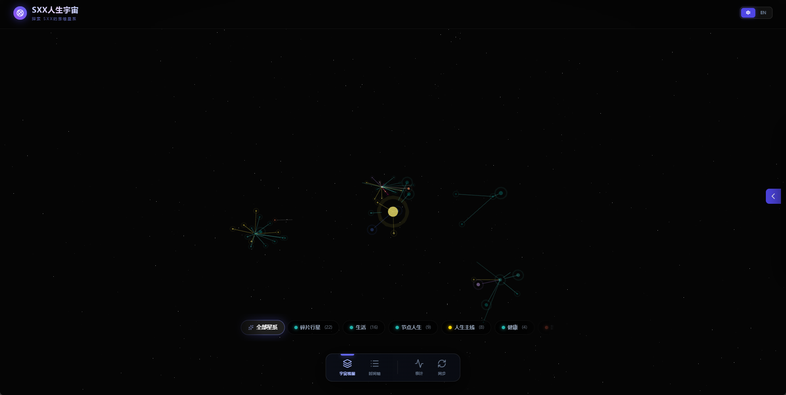

---

## 二、产品想象：人生不是时间线，而是星图

“混沌人生数据库”把记录对象从“文本条目”升级为“宇宙节点”。

每一条记录都不只是文字，而是带有“生命属性”的节点：

- 它有情绪色彩（快乐、焦虑、平静……）
- 它有重要程度（0-5）
- 它有主题归属（标签/星系）
- 它有空间位置（在宇宙中的坐标）

当节点不断累积，系统会自动形成星系、密度和轨迹。
你看到的不再是零散日记，而是“我的生活结构”。

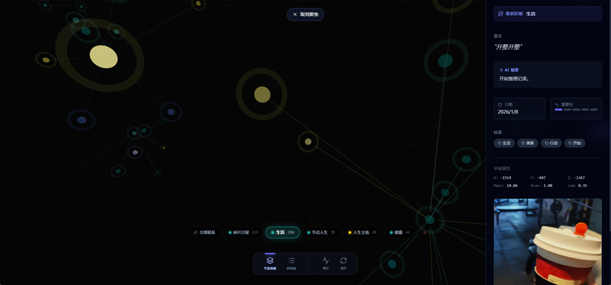

---

## 三、核心体验：从“记录”到“观测”

### 1. 记录：把瞬间留住

用户可以输入文字、上传图片，快速生成一个人生节点。
AI可自动补全情绪、重要性、标签和摘要。

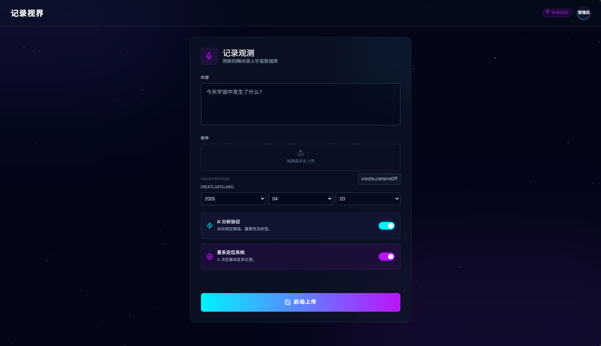

### 2. 观测：把关系看见

前端以三维宇宙可视化方式呈现节点群。
相似主题会聚集成星系，不同情绪会呈现不同光谱，重要节点更亮更醒目。

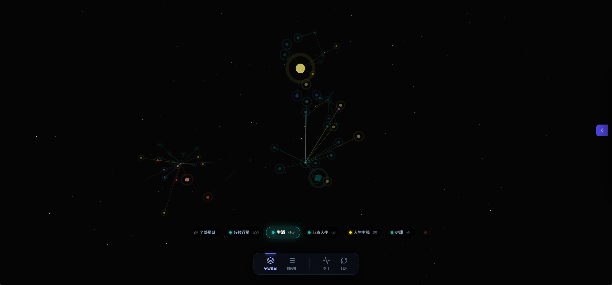

### 3. 回溯：把时间穿透

用户可按日/月/年切换观察维度，像“时间旅行”一样查看过去某段时期的状态。

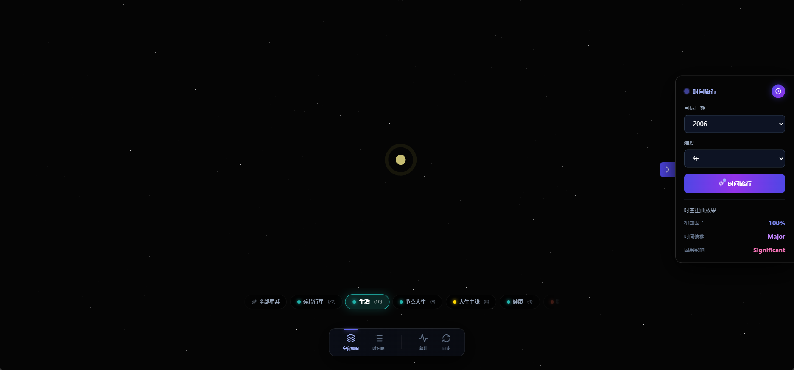

### 4. 理解：把经验沉淀

系统支持周/月/年度摘要，帮助用户从碎片中提炼趋势，而不是停留在“发生了什么”。

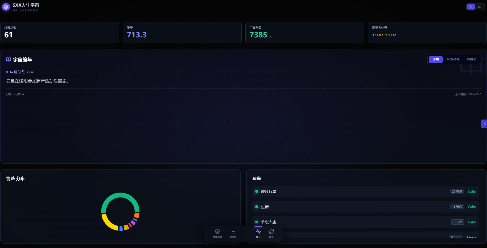

---

## 四、为什么它有价值

这个产品不是“帮你多记一点”，而是“帮你看懂一点”。

它的价值体现在三层：

- **个人层**：降低遗忘，增强自我理解，看到成长轨迹
- **认知层**：把情绪与事件从“瞬时感受”变成“可分析结构”
- **长期层**：通过持续摘要，形成可回顾的生命编年史

一句话概括：
**它让记忆从内容，变成结构；让生活从经历，变成可解释的宇宙。**

---

## 五、产品背后的设计选择

我们在设计上坚持三个原则：

- **低门槛输入**：记录应像发一条消息一样轻
- **高密度反馈**：每次记录都能被AI和可视化“放大理解”
- **长期可持续**：不是一次性惊艳，而是长期使用后越来越有价值

因此，系统既有管理端（可编辑、可校准、可维护），也有可视化端（可沉浸、可探索、可回望），并用统一数据层承载两者。

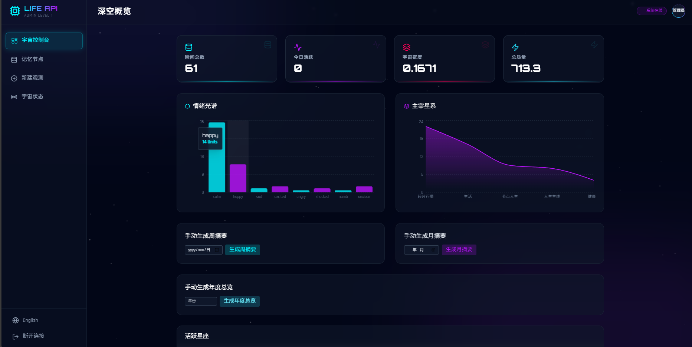

## 六、写在最后：这不只是一个工具

我们习惯把人生理解为“往前走”，
但很多重要的答案，其实藏在“回头看”的能力里。

“混沌人生数据库”希望做的，是给每个人一个可被反复进入的空间：
在那里，过去不是负担，而是星光；
记录不是任务，而是导航。

**当你愿意回看，你就不再只是经历生活，而是在理解生活。**

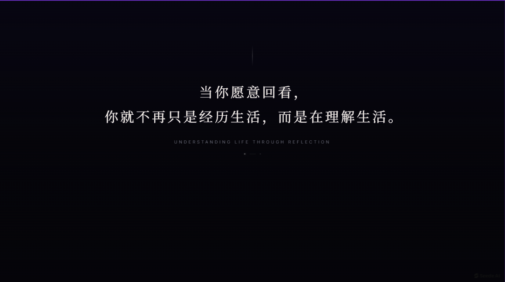

---

## 七、技术总结：让故事落地的工程骨架

如果说“宇宙叙事”是这款产品的外壳，那么真正支撑它可持续运行的，是一套可维护、可扩展、可回溯的工程结构。

### 1. 架构拆分：前端体验与后端能力解耦

系统采用“可视化前端 + 管理前端 + API服务 + Supabase数据层”的分层设计：

- 管理端负责内容治理：创建、编辑、删除、锚点调整、摘要触发
- 可视化端负责沉浸体验：三维宇宙、时间旅行、统计回顾
- 后端统一提供鉴权、节点计算、上传存储、摘要生成等能力
- 数据层集中承载结构化记录与多媒体资源

这种拆分的好处是：功能迭代不会相互牵制，前后端可以独立演进。

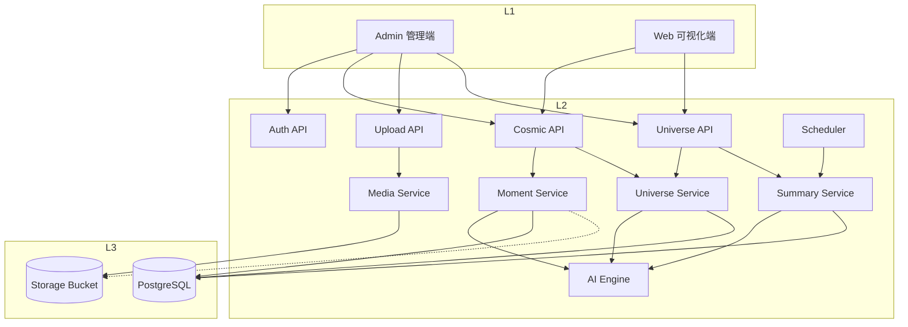

### 2. 数据模型：从“内容表”升级为“语义+空间表”

核心表 `moments` 不仅保存文本和附件，还保存 AI 字段与宇宙属性（坐标、质量、亮度、引力、星系归属）。
这样前端无需重算即可快速渲染，后端也能在查询阶段完成筛选和聚合。

同时，`constellations`、`weekly_summary`、`monthly_summary`、`life_summary` 让系统具备从点到面的长期总结能力。

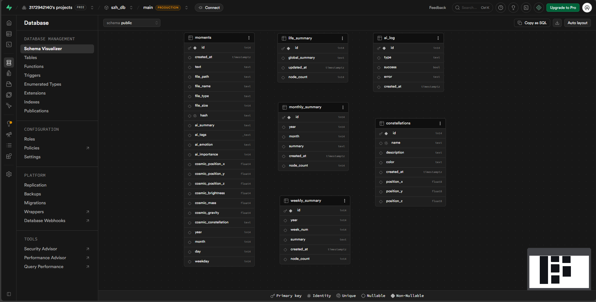

### 3. 关键工程收益：稳定、可扩展、可运营

- **稳定性**：鉴权、上传限制、错误处理、健康检查形成基础防线
- **可扩展性**：AI分析、星系策略、摘要任务都可独立升级
- **可运营性**：管理端支持手动干预（如锚点校准、摘要补跑），便于真实使用场景迭代

这意味着它不是一个“演示型项目”，而是一套可以持续打磨的产品底座。

## 八、Trae Solo 模式开发历程：一个人完成一整条产品链路

这个项目的另一个意义，是我在 **Trae Solo 模式**下完成了从想法到可运行产品的闭环。

### 1. 需求收敛：先确定“价值主线”，再写代码

在 Solo 模式下，我先把问题定义清楚：
不是做“又一个日记应用”，而是做“可视化的生命结构系统”。

因此需求被分成三条主线：

- 记录链路：输入-上传-AI分析-落库
- 观测链路：节点渲染-筛选-详情-时间旅行
- 沉淀链路：周/月/年摘要与长期回顾

### 2. 迭代策略：以可用闭环为单位推进

开发过程不是一次性铺开，而是分阶段闭环：

1. 打通最小闭环（登录、创建节点、查询节点）
2. 补齐可视化能力（三维展示、节点详情、筛选交互）
3. 增强运营能力（管理端编辑、锚点调整、摘要触发）
4. 强化稳定性（错误回退、重试、数据兜底）

这套节奏让项目在每个阶段都“可演示、可验证、可继续”。

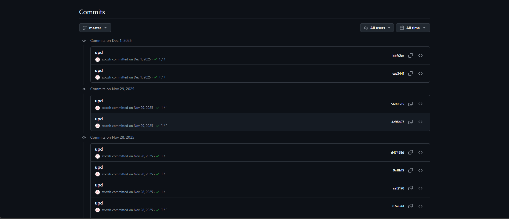

### 3. Solo 模式的真实收获

在 Trae Solo 模式里，我最直接的收获不是“写得更快”，而是“决策更清晰”：

- 从产品视角定义优先级，而不是只堆技术点
- 从用户路径拆解任务，而不是只按模块编码
- 从长期维护考虑结构，而不是只追求短期可跑

最终，这个项目既保留了个人表达的温度，也建立了工程实现的秩序。

---
